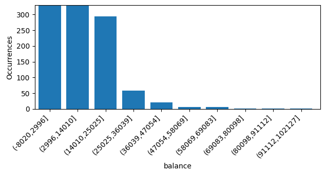
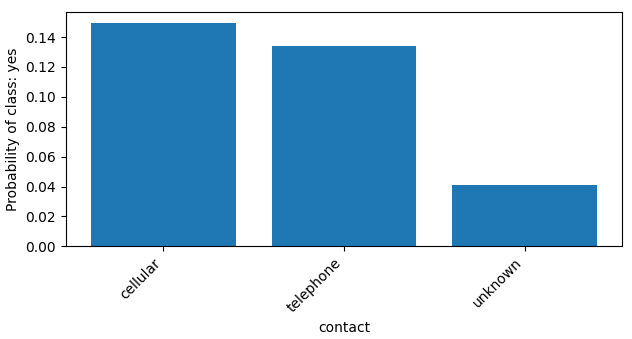
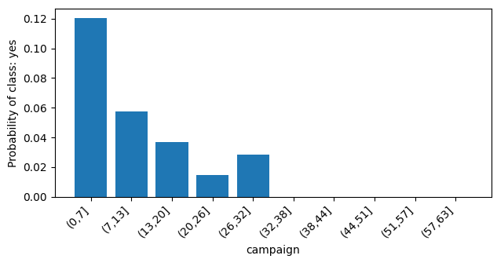

# Terminology

| Term                          | Notation | Meaning                                                         |
|-------------------------------|----------|-----------------------------------------------------------------|
| Input variable                | X        | Any given info based on which we must predict result            |
| Positive class probability    | P(y=1)   | Probability that client would subscribe a term deposit          |
| Linear feature                | -        | Feature equal to X                                              |
| Probability feature           | -        | P(y=1) for every unique value of an X                           |
| Linear probability feature    | -        | Inverse logistic function of probability feature                |
| Polynomial series of features | -        | Set of features, each representing some order of magnitude of X |

# Goal

Train a logistic regression model without using libraries for ML to predict whether a given bank customer will subscribe
a term deposit.

# Overview


```text
RangeIndex: 45211 entries, 0 to 45210
Total 17 columns
dtypes: int64(7), object(10)
```

**Target column**: y

# Closer look

### Age [0]

integer; non-null; [18, 95]


Numeric data. We'll derive a **polynomial series** of features from this column. From the graph we see that there are
very few examples with value > 80. This might lead to overfitting. We can't find more examples, so we'll try to filter
out them.

### Job [1]

text; non-null


This is categorical data. We'll derive **one-hot**, **probability** and **linear probability** features from this one to
see which one behaves better.

### Marital [2]

Marital status. Note: "divorced" means divorced or widowed.

text; non-null


This is categorical data. We'll derive **one-hot**, **probability** and **linear probability** features from this one to
see which one behaves better.

### Education [3]

text; non-null


This is categorical data. We'll derive **one-hot**, **probability** and **linear probability** features from this one to
see which one behaves better.

### Default [4]

Has credit in default?

text; non-null


This is binary data. The perfect case for **one-hot** encoding.

### Balance [5]

Average yearly balance, in euros

integer; non-null; [-8019, 102127]





Numeric data. We'll derive **polynomial series** of features from this one. Also, we have spikes of probability due to
lack of examples with value > 36039. This may lead to overfitting problem, so we'll try to filter out these examples.

### Housing [6]

Has housing loan?

text; non-null


This is binary data. The perfect case for **one-hot** encoding.

### Loan [7]

Has personal loan?

text; non-null


This is binary data. The perfect case for **one-hot** encoding.

### Contact [8]

Contact communication type. Related with the last contact of the current campaign.

text; non-null




This is categorical data. We'll derive **one-hot**, **probability** and **linear probability** features from this one to
see which one behaves better.

### Day [9]

Last contact day of the month. Related with the last contact of the current campaign.

integer; non-null; [1, 31]


Both numeric and categorical data. There might be a slight correlation between the size of the number and P(y=1). But
also it's likely that people tend to take biased decisions depending on specific dates. So we'll derive a **polynomial
series** of features, as well as **one-hot**, **probability** and **linear probability** features to see which one
behaves better.

### Month [10]

Last contact month of year. Related with the last contact of the current campaign.

text; non-null


Categorical data. We'll derive **one-hot**, **probability** and **linear probability** features from this one
to see which one behaves better.

### Duration [11]

Last contact duration, in seconds. Related with the last contact of the current campaign.

integer; non-null; [0, 4918]


Numeric data. We'll derive a **polynomial series** of features from this one.

### Campaign [12]

Number of contacts performed during this campaign and for this client (includes last contact).

integer; non-null; [1, 63]




Numeric data. Looks like a logistic function with a negative weight. We'll derive a **polynomial series** of features.
Also, notice that there are very few examples with value > 32. So, we'll try to filter them out to prevent overfitting.

### PDays [13]

Number of days that passed by after the client was last contacted from a previous campaign (-1 means client was not
previously contacted).

integer; non-null; [-1, 871]


Both numerical and categorical. We'll derive a **polynomial series** of features for this X. Also, it has a special
value of -1, which will add a bias to polynomial at this exact point. In order to prevent polynomial from distortion
we'll also introduce a **one-hot** variable for this special case. And finally, notice that there are very few examples
with value > 580. So, we'll try to filter them out to prevent overfitting.

### Previous [14]

Number of contacts performed before this campaign and for this client

integer; non-null; [0, 275]


Numeric data. We'll derive a **polynomial series** of features. Also, there are very few examples with value > 13. So,
we'll try to filter them out to prevent overfitting.

### POutcome [15]

Outcome of the previous marketing campaign.

text; non-null


This is categorical data. We'll derive **one-hot**, **probability** and **linear probability** features from this one to
see which one behaves better.

### Y [16]

Has the client subscribed a term deposit?

text; non-null


Classes will be: 1 (yes), 0 (no).

# Test

Examples: 1000

Learning curve:


Confusion matrix:


| Metric      | Value |
|-------------|-------|
| Accuracy    | 91.5% |
| Precision   | 70.3% |
| Sensitivity | 45.2% |
| Specificity | 97.5% |

# Conclusion

88.3% of the examples in the given dataset are negative, and only 11.7% are positive. If one would always pick 'no' as a
prediction he would be accurate by 88.3%. This model performs with accuracy 91.5%, which is not great. However, the
model has precision of 70.3% which means that if it predicted that some client would subscribe a deposit, it would be
right with 70.3% chance. Also, it has sensitivity of 45.2% which means that if some client will subscribe a deposit if
proposed, the model will detect him with probability of 45.2%.
One-hot, probability and linear probability - all the encodings performed equally. Adding polynomial combinations of
features didn't improve results. Overfitting wasn't detected as well. Therefore, we should try some other machine
learning algorythm - for example a neural network must perform better since we have a lot of data. Sadly, picking the
best model is not the goal of this project.
Nevertheless, this model does a pretty good job finding clients that would subscribe a term deposit (70.3% precision)
among large list of clients. If a bank can reach out only a limited number of clients, this model can improve their
marketing efficiency several times. And actually, the precision and sensitivity are a trade-off depending on the picked
threshold. Everything above was based on a threshold of 50%, meaning that model would pick only clients that would
subscribe a deposit with a chance above 50%. The bigger threshold - the bigger precision, but less sensitivity, and vice
versa.
Also, this model can sort clients by probability of them subscribing a term deposit. Therefore, if a bank can reach out
to every single client, the model still can help get subscriptions faster.

# Source

[Moro et al., 2011] S. Moro, R. Laureano and P. Cortez. Using Data Mining for Bank Direct Marketing: An Application of
the CRISP-DM Methodology.
In P. Novais et al. (Eds.), Proceedings of the European Simulation and Modelling Conference - ESM'2011, pp. 117-121,
Guimarães, Portugal, October, 2011. EUROSIS.

Available at: [pdf] http://hdl.handle.net/1822/14838
[bib] http://www3.dsi.uminho.pt/pcortez/bib/2011-esm-1.txt
