# Terminology

| Term                          | Notation | Meaning                                                         |
|-------------------------------|----------|-----------------------------------------------------------------|
| Input variable                | X        | Any given info based on which we must predict result            |
| Positive class probability    | P(y=1)   | Probability that client would subscribe a term deposit          |
| Linear feature                | -        | Feature equal to X                                              |
| Dummy feature                 | -        | Discrete binary variable for a value of X                       |
| Probability feature           | -        | P(y=1) for every unique value of an X                           |
| Linear probability feature    | -        | Inverse logistic function of probability feature                |
| Polynomial series of features | -        | Set of features, each representing some order of magnitude of X |

* P(y=1) - probability that client would subscribe a deposit (positive class).
* Linear probability - inverse logistic function of P(y=1).

# Overview

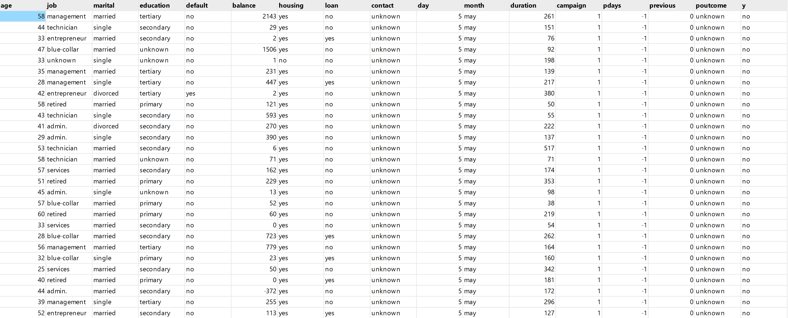

```text
RangeIndex: 45211 entries, 0 to 45210
Total 17 columns
dtypes: int64(7), object(10)
```

**Target column**: y

# Closer look

### Age [0]

integer; non-null; [18, 95]

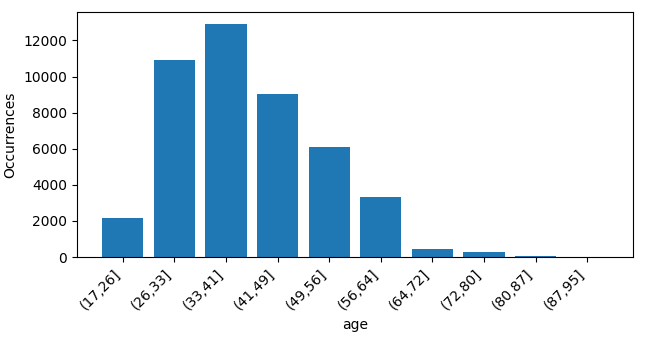

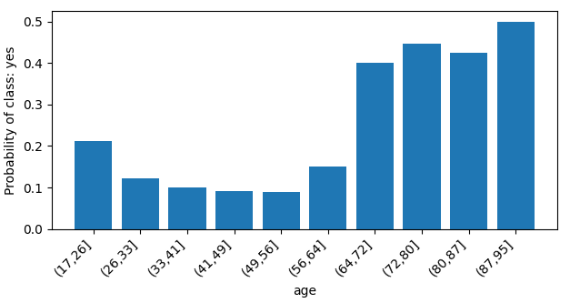

Numeric data. P(y=1) decreases until age 50 and then increases. It's not how logistic function behaves. So, we're going
to derive a **polynomial series** of features from this column. From the graph we see that there are very few examples
with value > 80. This might lead to overfitting. We can't find more examples, so we'll try to filter out these examples.

### Job [1]

text; non-null

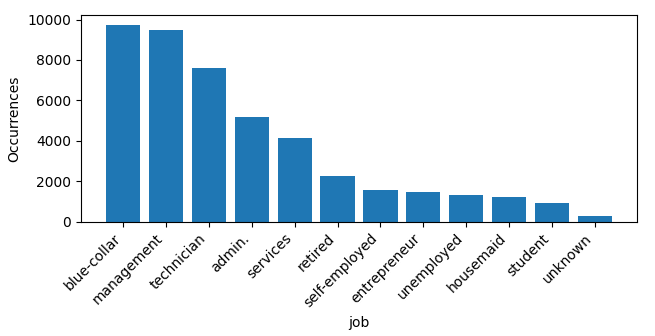

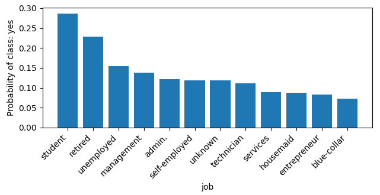

This is categorical data. We'll derive **dummy**, **probability** and **linear probability** features from this one to
see which one behaves better.

### Marital [2]

Marital status. Note: "divorced" means divorced or widowed.

text; non-null

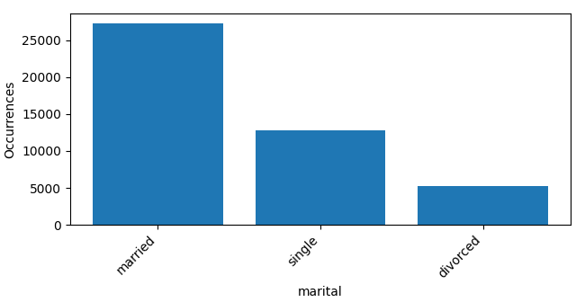

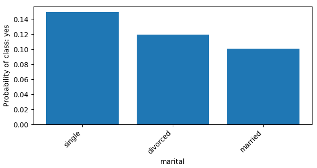

This is categorical data. We'll derive **dummy**, **probability** and **linear probability** features from this one to
see which one behaves better.

### Education [3]

text; non-null

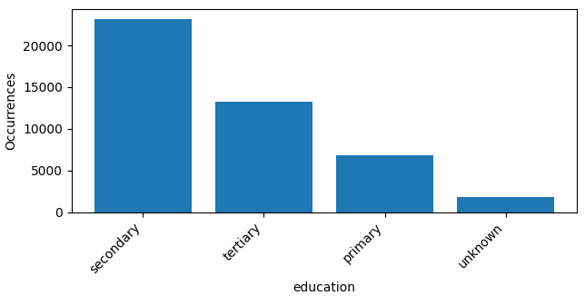

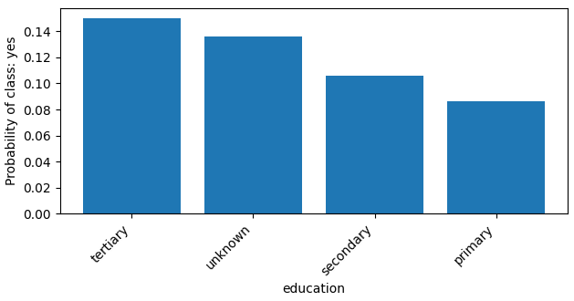

This is categorical data. We'll derive **dummy**, **probability** and **linear probability** features from this one to
see which one behaves better.

### Default [4]

Has credit in default?

text; non-null

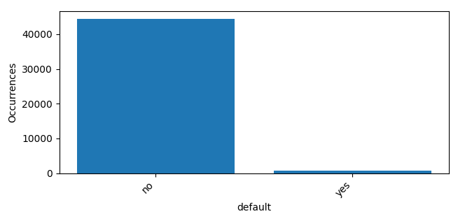

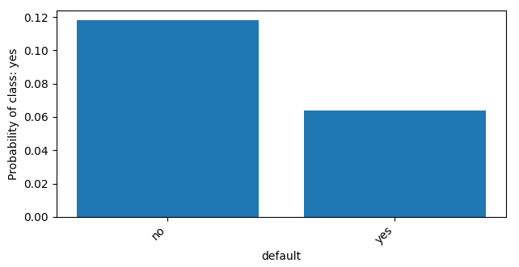

This is binary data. Seems to be the perfect case for introducing a dummy feature. But we'll derive **dummy**, **
probability** and **linear probability** features from this one to see for sure which one behaves better.

### Balance [5]

Average yearly balance, in euros

integer; non-null; [-8019, 102127]

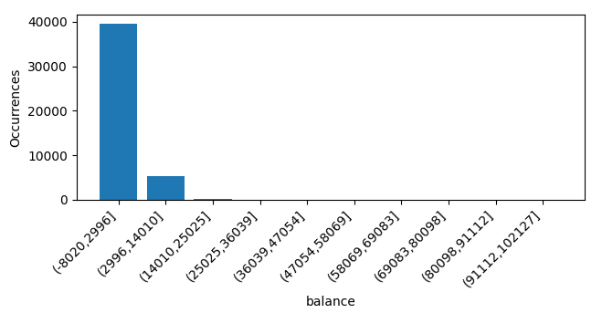

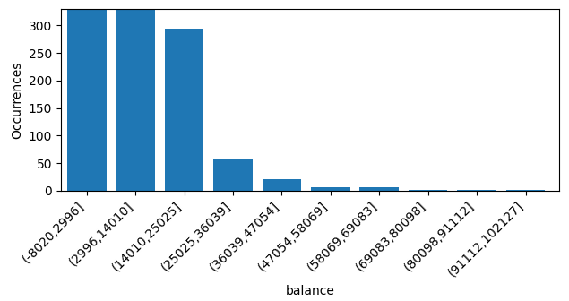

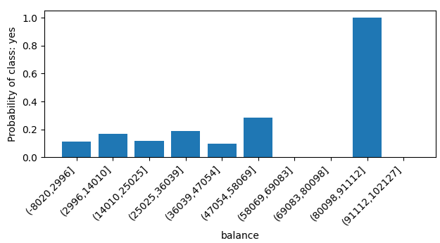

Numeric data. It seems to affect P(y=1) in a slightly linear manner. Also, we have spikes of probability due to lack of
examples with value > 36039. This may lead to overfitting problem, so we'll try to filter out these examples.

### Housing [6]

Has housing loan?

text; non-null

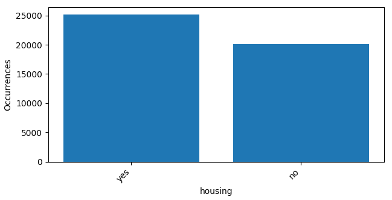

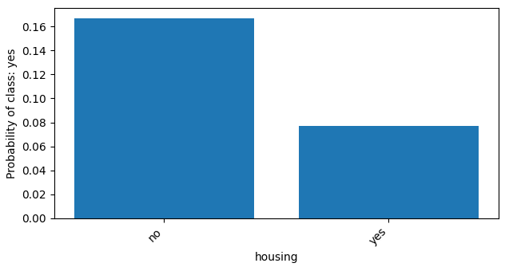

This is binary data. Seems to be the perfect case for introducing a dummy feature. But we'll derive **dummy**, **
probability** and **linear probability** features from this one to see for sure which one behaves better.

### Loan [7]

Has personal loan?

text; non-null

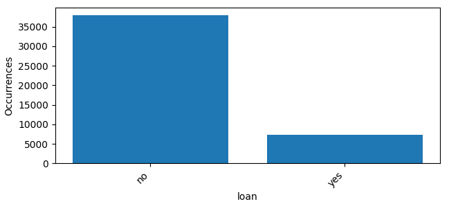

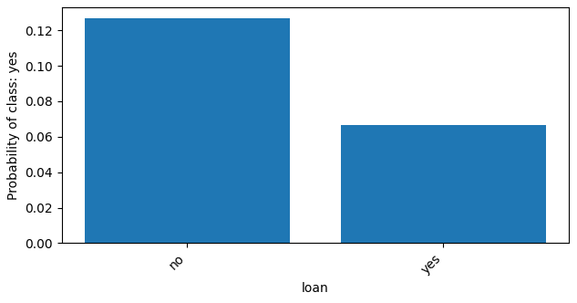

This is binary data. Seems to be the perfect case for introducing a dummy feature. But we'll derive **dummy**, **
probability** and **linear probability** features from this one to see for sure which one behaves better.

### Contact [8]

Contact communication type. Related with the last contact of the current campaign.

text; non-null

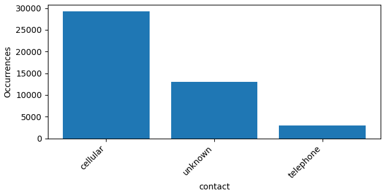

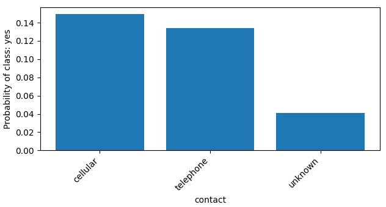

This is categorical data. We'll derive **dummy**, **probability** and **linear probability** features from this one to
see which one behaves better.

### Day [9]

Last contact day of the month. Related with the last contact of the current campaign.

integer; non-null; [1, 31]

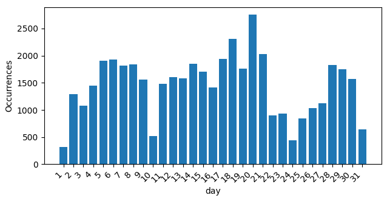

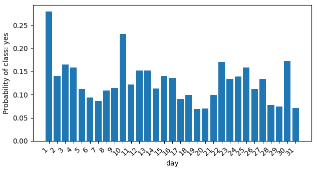

Both numeric and categorical data. There might be a slight correlation between the size of the number and P(y=1). But
also it's likely that people tend to take biased decisions depending on specific dates. So we'll derive a **linear**
feature for sure, and also **dummy**, **probability** and **linear probability** features to see which one behaves
better.

### Month [10]

Last contact month of year. Related with the last contact of the current campaign.

text; non-null

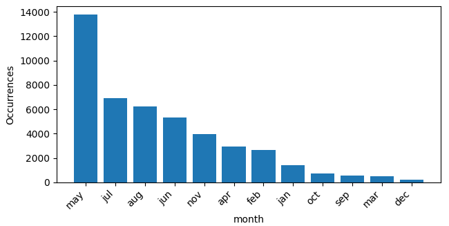

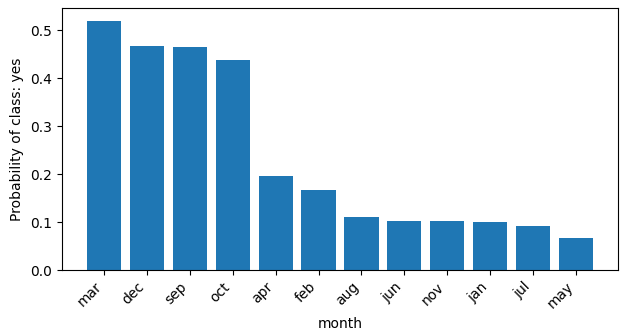

Categorical data. If we convert months to digits corresponding to their order, the function of P(y=1) will be wavy.
Furthermore, variable has a very limited set of possible values. Thus, it's not efficient to fit a polynomial. Instead,
we'll derive **dummy**, **probability** and **linear probability** features from this one to see which one behaves
better.

### Duration [11]

Last contact duration, in seconds. Related with the last contact of the current campaign.

integer; non-null; [0, 4918]

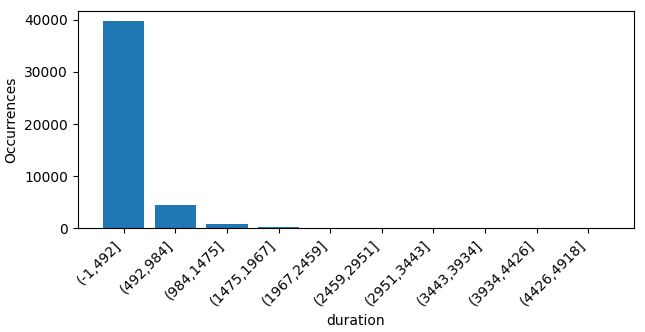

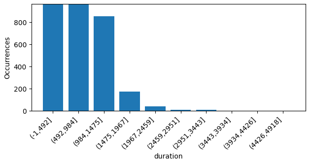

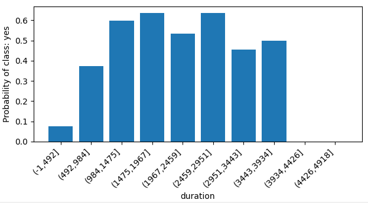

Numeric data. It doesn't look much like a logistic function, so we'll derive a **polynomial series** of features from
this one.

### Campaign [12]

Number of contacts performed during this campaign and for this client (includes last contact).

integer; non-null; [1, 63]

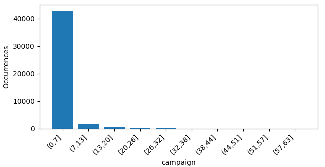

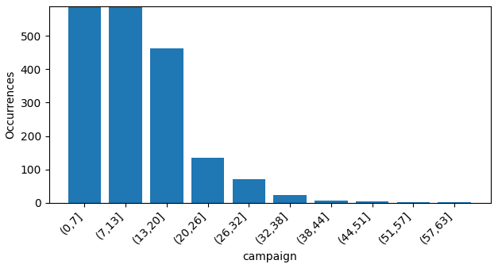

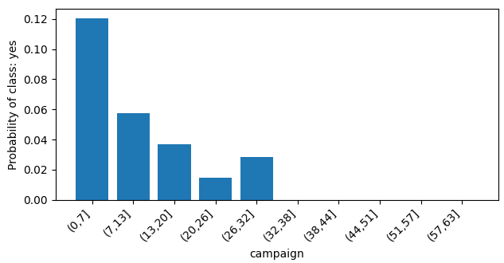

Numeric data. Looks like a logistic function with a negative weight. We'll derive a **linear** feature. Also, notice
that there are very few examples with value > 32. So, we'll try to filter them out to prevent overfitting.

### PDays [13]

Number of days that passed by after the client was last contacted from a previous campaign (-1 means client was
not previously contacted).

integer; non-null; [-1, 871]

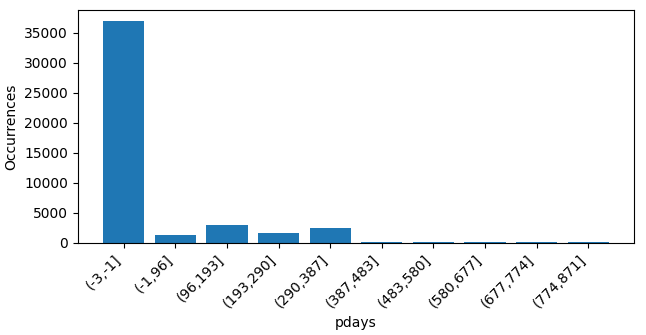

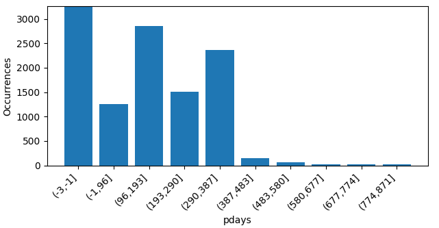

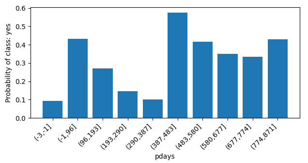

Both numerical and categorical. First of all, it doesn't look like a logistic function, so we'll derive a **polynomial
series** of features for this X. Also, it has a special value of -1, which will add a bias to polynomial at this exact
point. In order to prevent polynomial from distortion we'll also introduce a **dummy** variable for this special case.
And finally, notice that there are very few examples with value > 580. So, we'll try to filter them out to prevent
overfitting.

### Previous [14]

Number of contacts performed before this campaign and for this client

integer; non-null; [0, 275]

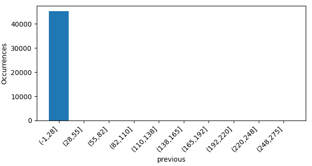

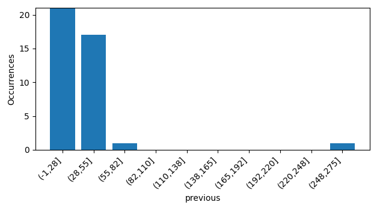

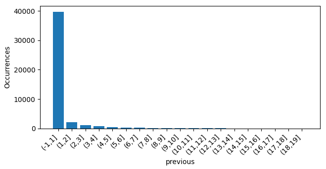

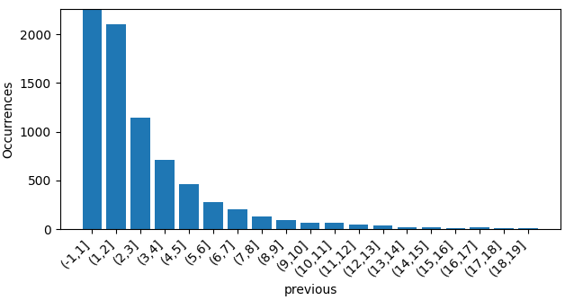

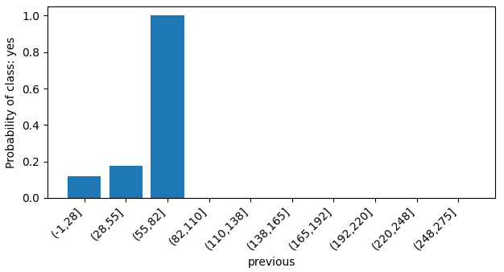

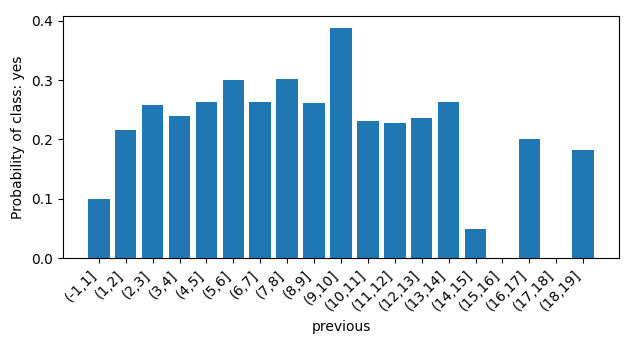

Numeric data. Looks much like a sigmoid function with a negative weight. Therefore, we'll derive a **linear** feature.
Also, there are very few examples with value > 13. So, we'll try to filter them out to prevent overfitting.

### POutcome [15]

Outcome of the previous marketing campaign.

text; non-null


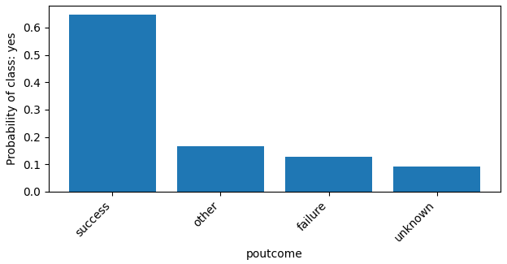

This is categorical data. We'll derive **dummy**, **probability** and **linear probability** features from this one to
see which one behaves better.

### Y [16]

Has the client subscribed a term deposit?

text; non-null

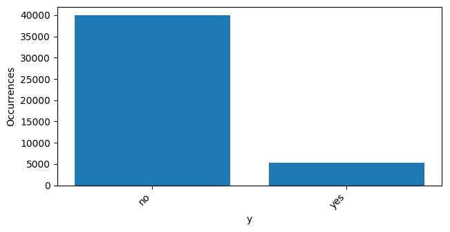

Classes will be: 1 (yes), 0 (no).

# Source

[Moro et al., 2011] S. Moro, R. Laureano and P. Cortez. Using Data Mining for Bank Direct Marketing: An Application of
the CRISP-DM Methodology.
In P. Novais et al. (Eds.), Proceedings of the European Simulation and Modelling Conference - ESM'2011, pp. 117-121,
Guimarães, Portugal, October, 2011. EUROSIS.

Available at: [pdf] http://hdl.handle.net/1822/14838
[bib] http://www3.dsi.uminho.pt/pcortez/bib/2011-esm-1.txt
